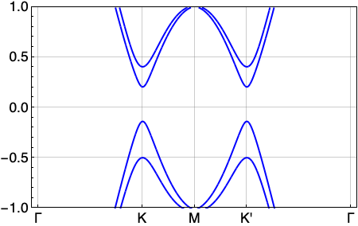
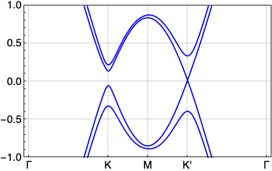
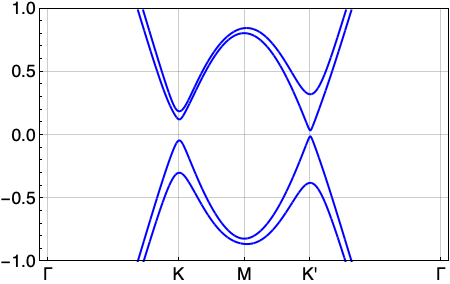
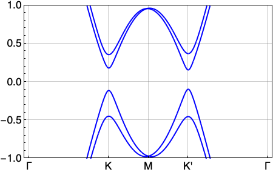
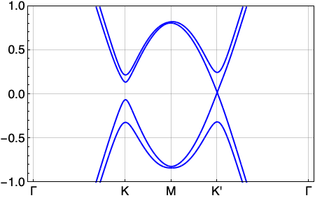
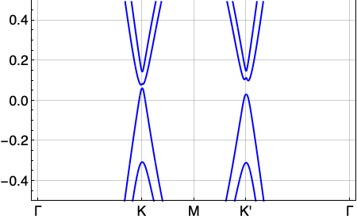
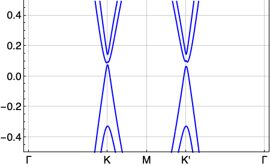
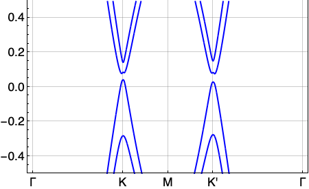

# Summary of work on Kane-Mele model

## Results

- Starting from params "$t=1$, $\lambda_{SO}$=0.06, $\lambda_{R}$=0.05, $\lambda_{v}$=0.1", without light, the system is in QSH state. Increasing the intensity of light, the system will change from QSH into Chern Insulator with $C=\pm1$, and finally into an insulator.

- Starting from params "$\theta$=2$\pi$/3, t=1, $\lambda_{SO}$=0.018, $\lambda_{R}$=0.08, $\lambda_{v}$=0.015", without light, the system is in Insulator state. Increasing the intensity of light, the system will change from Insulator into Chern Insulator with $C=\pm2$.

## Details

### 1. QSH to $C = \pm 1$

#### 1.1 CPL

Params: t=1, $\lambda_{SO}$=0.06, $\lambda_{R}$=0.05, $\lambda_{v}$=0.1

[//]: # (::: {#fig-oneside layout="[[75,25]]"})
[//]: # ()
[//]: # (![Green Function]&#40;./imgs/conducting_one_side.png&#41;{#fig-con})
[//]: # ()
[//]: # (![Lattice]&#40;./imgs/lattice_left.jpg&#41;{#fig-lat})
[//]: # ()
[//]: # (Conduct on one side.)
[//]: # (:::)

#### 1.2 BCL

Params: $\theta$=2$\pi$/3, t=1, $\lambda_{SO}$=0.06, $\lambda_{R}$=0.05, $\lambda_{v}$=0.1

### 2. Insulator to $C = \pm 2$

#### 2.1 CPL

Params: $ t=1, $\lambda_{SO}$=0.018, $\lambda_{R}$=0.08, $\lambda_{v}$=0.015

#### 2.2 BCL

Params: $\theta$=2$\pi$/3, t=1, $\lambda_{SO}$=0.018, $\lambda_{R}$=0.08, $\lambda_{v}$=0.015

